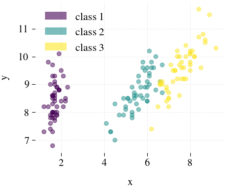
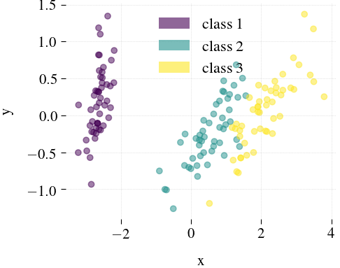
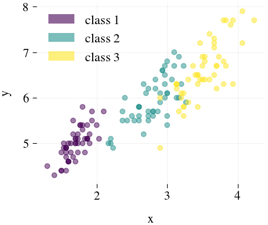
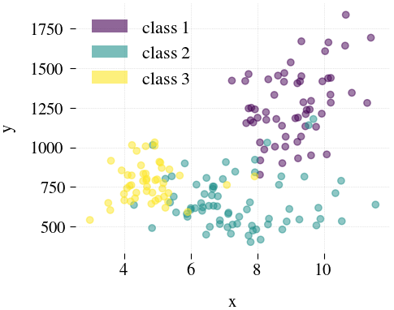
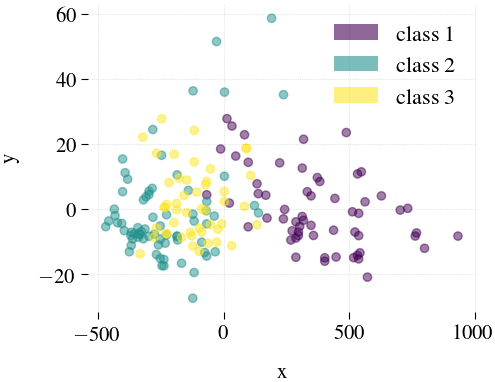
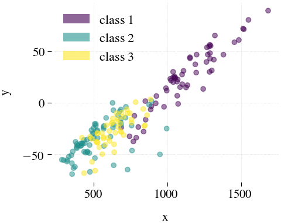
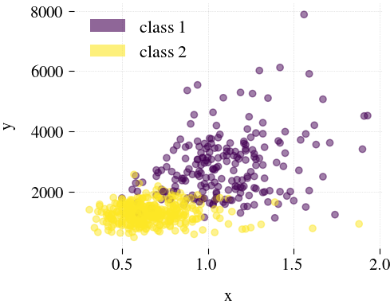
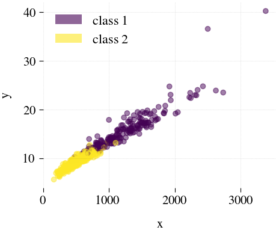
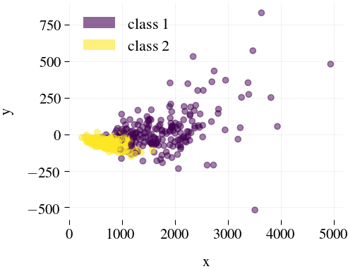

## Mdr (Multilevel dimensionality reduction)

**About**

This is an Python implementation of multilevel dimensionality reduction, published by Alan et. al. [1]. The implementation is based on multilevel approach for combinatorial optimization that can perform in bipartite context.

**Download**

* You can download the Mdr software in http://www.alanvalejo.com.br/software?name=mdr

**Usage**

> Coarsening by levels. The user defines the number of levels and the reduction factor at each level.

	$ python mdr-mob.py [options]
	$ python mdr-opm.py [options]

> You can load the parameters from a .json file.

	$ python mdr-mob.py -cnf input/iris-mdr-rgmb.json

> You can use the software from sklearn pattern class.

	$ from skl.mdr import MDR
	$ from sklearn import datasets
	$ data = datasets.load_iris()
	$ X_reduced = MDR(max_levels=1, reduction_factor=0.5).transform(data.data)

| Option             | Domain        | Default   | Description                          |
| ------------------ | ------------- | --------- | ------------------------------------ |
| -in --input        | string [FILE] | None      | name of the input file to be loaded  |
| -dir --directory   | string [DIR]  | '.'       | directory of output file             |
| -out --output      | string [FILE] | filename  | name of the file to be save          |
| -cnf --conf        | string [FILE] | None      | name of the config file to be loaded |
| -v --vertices      | int           | None      | number of vertices for each layer    |
| -r --rf            | (0 0.5]       | [0.5 0.5] | reduction factor for each layer      |
| -m --ml            | [0 n]         | [3 3]     | max levels for each layer            |
| -c --matching      | string        | [hem hem] | matching method for each layer       |
| -s --similarity    | string        | None      | similarity measure for each layer    |
| --save_conf        | boolean       | false     | save config file                     |
| --save_ncol        | boolean       | false     | save ncol format                     |
| --save_gml         | boolean       | false     | save gml format                      |
| --save_source      | boolean       | false     | save source reference                |
| --save_predecessor | boolean       | false     | save predecessor reference           |
| --save_successor   | boolean       | false     | save successor reference             |
| --save_hierarchy   | boolean       | false     | save all levels of hierarchy         |
| --save_adjacency   | boolean       | false     | save weighted adjacency matrix       |
| --save_timing_json | boolean       | False     | save timing in json                  |
| --save_timing_csv  | boolean       | False     | save timing in csv                   |
| --show_timing      | boolean       | false     | show timing                          |
| --unique_key       | boolean       | false     | output date and time as unique_key   |

The matching strategy selects the best pairs of vertices for matching. Formally, a matching $M$ can be denoted by a set of pairwise non-adjacent edges, i.e., a set of edges with no common vertices. In this software it is possible use two matching methods:

For mdr-mob.py use:

> * Greed Rand Twohopes
> * Greed Twohopes

For mdr-opm.py use:

> * Hem
> * Lem
> * Rm

The matching strategy is, therefore, a key component of an effective multilevel optimization, as it leads to a good hierarchy of coarsened networks for supporting the local search algorithm. A poor choice of the matching impairs the multilevel process, hence, the performance of the local search algorithm. In this software it is possible use some similarity measures:

For both scripts, mdr-mob.py and mdr-opm.py you can use:

> * Common Neighbors
> * Weighted Common Neighbors
> * Preferential Attachment
> * Jaccard
> * Salton
> * Adamic Adar
> * Resource Allocation
> * Sorensen
> * Hub Promoted
> * Hub Depressed
> * Leicht Holme Newman

**Dependencies**

* Python: tested with version 2.7.13.
* Packages required: [igraph](http://igraph.sourceforge.net); [scipy](http://www.scipy.org/); [sklearn](http://scikit-learn.org/); [numpy](http://www.numpy.org/)

**Anaconda**

	$ export PATH=~/anaconda3/bin:$PATH
	$ conda create --name python27 python=2.7
	$ source activate python27
	$ conda install -c anaconda numpy scikit-learn (in same cases use numpy=1.13)
	$ conda install -c conda-forge python-igraph

**Quick benchmark results**

We test three well-known datasets (Iris, Wine and Breast Cancer) and three well-known dimensionality reduction algorithm (PCA, FA and LSA).

	# Mdr using Greed Rand Twohopes coarsening algorithm (Execute more time to find the best result)
	$ python plot2D.py wine mdr 1 0.5 greedy_seed_twohops

	# Mdr using Greed Twohopes coarsening algorithm
	$ python plot2D.py wine mdr 3 0.5 greedy_twohops

	# Mdr using HEM coarsening algorithm
	$ python plot2D.py breast-cancer mdr 4 0.5 HEM

	# Principal component analysis (PCA)
	$ python plot2D.py pca iris
	$ python plot2D.py pca wine
	$ python plot2D.py pca breast-cancer

	# Feature Agglomeration (FA)
	$ python plot2D.py fa iris
	$ python plot2D.py fa wine
	$ python plot2D.py fa breast-cancer

	# Truncated SVD (aka LSA)
	$ python plot2D.py lsa iris
	$ python plot2D.py lsa wine
	$ python plot2D.py lsa breast-cancer

**Iris**

| Mdr                      | Principal component analysis (PCA) |
| ------------------------ | ---------------------------------- |
|  |            |

| Feature Agglomeration   | Truncated SVD (aka LSA)  | t-distributed Stochastic Neighbor Embedding |
| ----------------------- | ------------------------ | ------------------------------------------- |
|  |  |                    |

**Wine**

| Mdr                      | Principal component analysis (PCA) |
| ------------------------ | ---------------------------------- |
|  |            |

| Feature Agglomeration   | Truncated SVD (aka LSA)  | t-distributed Stochastic Neighbor Embedding |
| ----------------------- | ------------------------ | ------------------------------------------- |
|  |  |                    |

**Breast Cancer**

| Mdr                               | Principal component analysis (PCA) |
| --------------------------------- | ---------------------------------- |
|  |   |

| Feature Agglomeration            | Truncated SVD (aka LSA)           | t-distributed Stochastic Neighbor Embedding |
| -------------------------------- | --------------------------------- | ------------------------------------------- |
|  |  |           |

**Known Bugs**

Please contact the author for problems and bug report.

**Contact**

* Alan Valejo.
* Ph.D. candidate at University of São Paolo (USP), Brazil.
* alanvalejo@gmail.com.

**License (COPYING.md)**

* Can be used for creating unlimited applications
* Can be distributed in binary or object form only
* Non-commercial use only
* Can modify source-code and distribute modifications (derivative works)
* Giving credit to the author by citing the papers [1,2]
* License will expire in 2018, July, and will be renewed.

**References**
> [1] Valejo, A.; Rocha Filho, G. P.; Oliveira, M. C. F.; and Lopes, A. A.: A Multilevel approach for combinatorial optimization in bipartite networks. Knowledge-Based Systems (2018)

~~~~~{.bib}
@article{Alan_2014,
    author={Valejo, A.; Rocha Filho, G. P.; Oliveira, M. C. F.; and Lopes, A. A.},
    title={Multilevel approach for combinatorial optimization in bipartite networks},
    journal={Knowledge-Based Systems},
    year={2018},
}
~~~~~

 &copy; Copyright (C) 2017 Alan Valejo &lt;alanvalejo@gmail.com&gt; All rights reserved.

